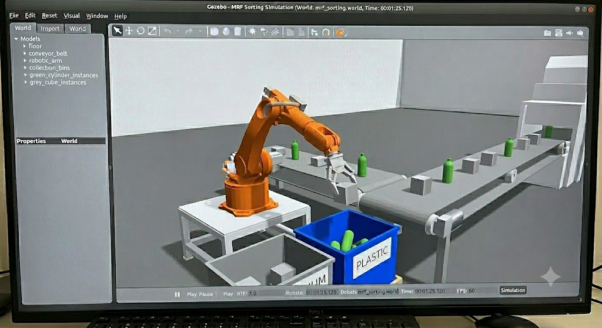

# MRF Sorting Simulation

A ROS 2 Humble + Gazebo Classic 11 simulation of a **Material Recovery Facility
(MRF)** sorting cell, built to the design assumptions in [guide.md](guide.md)
(sections 27–40) and the reference image: an orange industrial arm on a white
pedestal recovers selected materials from a never-stopping conveyor into
labelled bins.



## What it does

- A conveyor carries randomly-placed objects (rotated, offset, varied spacing —
  *not* tidy rows). **The belt never stops** (§33).
- Objects are generated with a **ground-truth category** baked in at spawn time
  (green cylinder = `plastic`, grey cube = `aluminum`, tan box = `cardboard`).
- A **simulated perception layer** republishes Gazebo ground truth through a
  detector-agnostic interface (`mrf_msgs/PerceivedObjectArray`). The robots only
  ever talk to this interface — never to Gazebo or the generator (§30–32), so
  the perception node can later be swapped for YOLO/RT-DETR/etc.
- **Two arms face each other across the belt.** Arm 1 recovers `plastic` into
  the blue bin; Arm 2 (downstream, offset in X) recovers `aluminum` into its own
  bin. Each is an independent coordinator instance.
- **Moving-belt intercept**: each arm hovers over its pick point and only
  commits to (claims) an object once it arrives directly underneath, so the belt
  and every other object keep flowing the whole time. Only the object actually
  being grasped pauses — because the arm is holding it.
- Everything else flows past. Objects that leave the work envelope, or that pass
  while an arm is busy, are counted **MISSED** — by design (§38).

## Packages

| package | role |
|---|---|
| `mrf_msgs` | `PerceivedObject` / `PerceivedObjectArray` perception interface |
| `mrf_description` | arm xacro **macro** (6R + spherical wrist), instantiated twice; ros2_control |
| `mrf_gazebo` | world: two pedestals, conveyor, plastic + aluminum bins |
| `mrf_perception` | simulated ground-truth perception layer |
| `mrf_coordinator` | object generator, conveyor, IK, scheduler/executor (one per arm) |
| `mrf_bringup` | top-level launch (spawns both arms + both coordinators) |

## Build

```bash
cd ~/robotic_arm_ws
source /opt/ros/humble/setup.bash
colcon build --symlink-install
```

## Run

```bash
source /opt/ros/humble/setup.bash
source install/setup.bash
export GAZEBO_MODEL_PATH=$GAZEBO_MODEL_PATH:$PWD/install/mrf_gazebo/share/mrf_gazebo/models

# two arms: arm1 -> plastic bin, arm2 -> aluminum bin
ros2 launch mrf_bringup mrf_sim.launch.py

# headless
ros2 launch mrf_bringup mrf_sim.launch.py gui:=false
```

Each arm is configured entirely by parameters on its `coordinator` instance
(`joint_prefix`, `arm_topic`, `base_x/y/z/yaw`, `pick_x`, `bin_x/y`,
`target_categories`) — see [mrf_sim.launch.py](src/mrf_bringup/launch/mrf_sim.launch.py).
To add a third arm, instantiate `kr_arm` again in
[robot.urdf.xacro](src/mrf_description/urdf/robot.urdf.xacro), add its controllers
to [controllers.yaml](src/mrf_description/config/controllers.yaml), and launch
one more coordinator.

## Useful topics

```bash
ros2 topic echo /mrf/perception/objects     # the perception interface
ros2 topic echo /mrf/coordinator/stats       # recovered / target / ignored counts
ros2 topic echo /mrf/objects/stats           # spawned / on_belt / missed
ros2 topic echo /mrf/conveyor/state          # RUNNING_FAST | MEDIUM | SLOW (never STOPPED)
ros2 service call /mrf/conveyor/cycle_speed std_srvs/srv/Trigger   # change belt speed
```

## Design notes

- **Grasping is kinematic.** Form-closure grasping is unreliable in Gazebo
  Classic, so a committed pick "claims" the object (the generator stops moving
  it) and the coordinator slaves its pose to the live tool-centre point until
  it is released over the bin. The gripper fingers are cosmetic.
- **IK** is a closed-form solution for the 6R-with-spherical-wrist arm
  (`mrf_coordinator/ik.py`); run `python3 ik.py` for the FK∘IK self-test.
- Kinematic constants are shared between `kr_arm.xacro` and `ik.py` — keep them
  in sync if you change link lengths.
